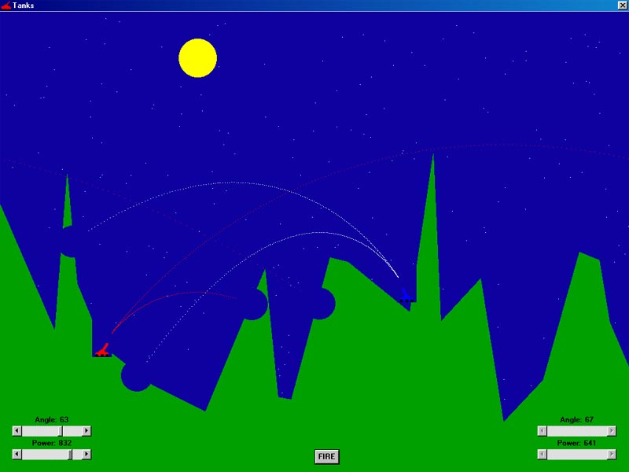



## Another VB Tanks GAME\! \- see screenshot

### Description

Yet another TANKS game. This one is a lot better then most I have seen. Although there is no sound (I wanted to cut down on .zip size) it is totally randomized when you play! It is really nice, the land, sky, stars, tank position, sun/moon is always different every game! You should check it out especially if your working on your version of tanks. It is basic in the sense there isn't a million weapons to play with, but everything works like a charm. You can add on to my work with more options, it will save you time instead of getting the game to work. Check it out!

Also look at other games and projects I have submitted!
 
### More Info
 

             |
---                |---
**Submitted On**   |2001-02-16 17:33:18
**By**             |[Haig Demerdjian](https://github.com/Planet-Source-Code/PSCIndex/blob/master/ByAuthor/haig-demerdjian.md)
**Level**          |Intermediate
**User Rating**    |4.5 (18 globes from 4 users)
**Compatibility**  |VB 5\.0, VB 6\.0
**Category**       |[Games](https://github.com/Planet-Source-Code/PSCIndex/blob/master/ByCategory/games__1-38.md)
**World**          |[Visual Basic](https://github.com/Planet-Source-Code/PSCIndex/blob/master/ByWorld/visual-basic.md)
**Archive File**   |[CODE\_UPLOAD152742202001\.zip](https://github.com/Planet-Source-Code/haig-demerdjian-another-vb-tanks-game-see-screenshot__1-21209/archive/master.zip)

